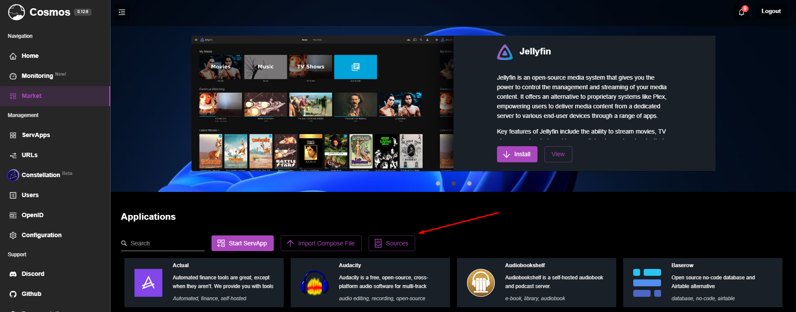
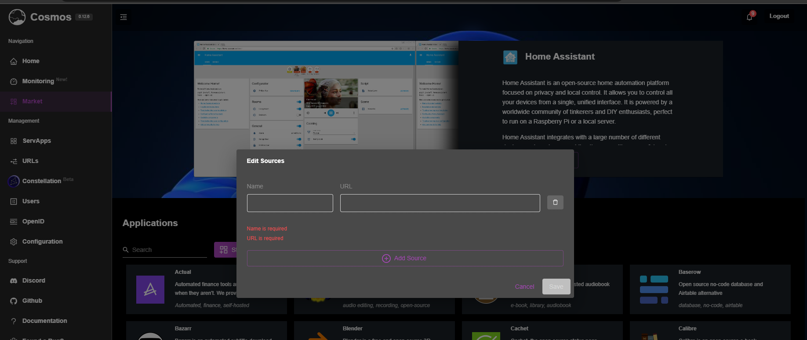

<!-- [![Codacy grade][codacy-grade]][codacy-repo] -->
![Pre-Release][pre-release]
<!-- ![Version][version] -->

<h1>

[Cosmos Server Servapps][release]

</h1>

### _An App Marketplace for Cosmos_

[![GitHub issues][issues-badge]][issues]
![Last Commit][commit-badge]
![MIT][license-badge]
 
[![wakatime][wakatime-badge]][wakatime-repo]

## [Installation](#top) 📂

### Step 1

Click the 'sources' button on the 'market' screen

### Step 2

<small>These images were stolen quite brazenly from the <a href="https://github.com/TinyActive/cosmos-servapps" target="blank">TinyActive</a> Cosmos Server Apps Repo</small>

Add the information below in the form in the image above:

> [!important]
> Name: Ragdata
>
> URL: https://ragdata.github.io/cosmos-servapps/

## [Features](#top) ✨

| App                         | Category    | Web             | Code            | Docs           | Subnet           |
|:----------------------------|:------------|:---------------:|:---------------:|:--------------:|:-----------------|
| [Activepieces][act]         | Automation  | [🌐][act-web]   | [💾][act-cod]  | [📖][act-doc]  | 172.16.8.0/24    |
| [Calibre-Web][cal]          | Doc Mgmt    | [🌐][cal-web]   | [💾][cal-cod]  | [📖][cal-doc]  | 172.16.20.0/24   |
| [Dozzle][doz]               | Utilities   | [🌐][doz-web]   | [💾][doz-cod]  | [📖][doz-doc]  | 172.16.1.0/24    |
| [Excalidraw][exc]           | Whiteboard  | [🌐][exc-web]   | [💾][exc-cod]  | [📖][exc-doc]  | 172.16.14.0/24   |
| [Gitea-Actions][git]        | CI/CD       | [🌐][git-web]   | [💾][git-cod]  | [📖][git-doc]  | 172.16.4.0/24    |
| [Handbrake][hnd]            | Video       | [🌐][hnd-web]   | [💾][hnd-cod]  | [📖][hnd-doc]  | 172.16.9.0/24    |
| [Homarr v1.x][hom]          | Dashboards  | [🌐][hom-web]   | [💾][hom-cod]  | [📖][hom-doc]  | 172.16.7.0/24    |
| [Huginn][hug]               | Automation  | [🌐][hug-web]   | [💾][hug-cod]  | [📖][hug-doc]  | 172.16.19.0/24   |
| [Immich][imm]               | Photos      | [🌐][imm-web]   | [💾][imm-cod]  | [📖][imm-doc]  | 172.16.6.0/24    |
| [IT-Tools][itt]             | Utilities   | [🌐][itt-web]   | [💾][itt-cod]  | [📖][itt-doc]  | 172.16.2.0/24    |
| [Linkwarden][lnk]           | Bookmarks   | [🌐][lnk-web]   | [💾][lnk-cod]  | [📖][lnk-doc]  | 172.16.5.0/24    |
| [Mattermost][mat]           | Chat        | [🌐][mat-web]   | [💾][mat-cod]  | [📖][mat-doc]  | 172.16.15.0/24   |
| [MKVTools][mkv]             | Video       | [🌐][mkv-web]   | [💾][mkv-cod]  | [📖][mkv-doc]  | 172.16.10.0/24   |
| [N8n][n8n]                  | Automation  | [🌐][n8n-web]   | [💾][n8n-cod]  | [📖][n8n-doc]  | 172.16.12.0/24   |
| [NetAlertX][net]            | Security    | [🌐][net-web]   | [💾][net-cod]  | [📖][net-doc]  | 172.16.16.0/24   |
| [Notifiarr][not]            | Messaging   | [🌐][not-web]   | [💾][not-cod]  | [📖][not-doc]  | 172.16.17.0/24   |
| [Portainer BE][pbe]         | Containers  | [🌐][pbe-web]   | [💾][pbe-cod]  | [📖][pbe-doc]  | 172.17.0.0/24    |
| [Postiz][ptz]               | Social Mgmt | [🌐][ptz-web]   | [💾][ptz-cod]  | [📖][ptz-doc]  | 172.16.11.0/24   |
| [Uptime-Kuma][upk]          | Analytics   | [🌐][upk-web]   | [💾][upk-cod]  | [📖][upk-doc]  | 172.16.13.0/24   |
| [Vaultwarden][vlw]          | Passwords   | [🌐][vlw-web]   | [💾][vlw-cod]  | [📖][vlw-doc]  | 172.16.3.0/24    |
| [Yopass][yop]               | Secrets     | [🌐][yop-web]   | [💾][yop-cod]  | [📖][yop-doc]  | 172.16.18.0/24   |

[`^ Top`](#top)

[sce]: https://github.com/Ragdata/cosmos-servapps/tree/master/servapps/activepieces
[sce-web]: https://www.activepieces.com/
[sce-cod]: https://github.com/activepieces/activepieces/
[sce-doc]: https://seafile.readthedocs.io/en/latest/

[pro]: https://github.com/Ragdata/cosmos-servapps/tree/master/servapps/activepieces
[pro-web]: https://www.activepieces.com/
[pro-cod]: https://github.com/activepieces/activepieces/
[pro-doc]: https://www.seafile.com/en/support/

[ood]: https://github.com/Ragdata/cosmos-servapps/tree/master/servapps/activepieces
[ood-web]: https://www.activepieces.com/
[ood-cod]: https://github.com/activepieces/activepieces/
[ood-doc]: https://helpcenter.onlyoffice.com/

[act]: https://github.com/Ragdata/cosmos-servapps/tree/master/servapps/activepieces
[act-web]: https://www.activepieces.com/
[act-cod]: https://github.com/activepieces/activepieces/
[act-doc]: https://www.activepieces.com/docs/getting-started/introduction

[cal]: https://github.com/Ragdata/cosmos-servapps/tree/master/servapps/calibre-web
[cal-web]: https://calibre-ebook.com/
[cal-cod]: https://github.com/janeczku/calibre-web
[cal-doc]: https://calibre-ebook.com/help

[doz]: https://github.com/Ragdata/cosmos-servapps/tree/master/servapps/dozzle
[doz-web]: https://dozzle.dev/
[doz-cod]: https://github.com/amir20/dozzle
[doz-doc]: https://dozzle.dev/guide/what-is-dozzle

[exc]: https://github.com/Ragdata/cosmos-servapps/tree/master/servapps/excalidraw
[exc-web]: https://excalidraw.com/
[exc-cod]: https://github.com/excalidraw/excalidraw/
[exc-doc]: https://github.com/excalidraw/excalidraw/discussions

[git]: https://github.com/Ragdata/cosmos-servapps/tree/master/servapps/gitea-actions
[git-web]: https://about.gitea.com/
[git-cod]: https://github.com/go-gitea/gitea
[git-doc]: https://docs.gitea.com/

[hnd]: https://github.com/Ragdata/cosmos-servapps/tree/master/servapps/handbrake
[hnd-web]: https://handbrake.fr/
[hnd-cod]: https://github.com/jlesage/docker-handbrake
[hnd-doc]: https://handbrake.fr/docs/

[hom]: https://github.com/Ragdata/cosmos-servapps/tree/master/servapps/homarr
[hom-web]: https://homarr.dev/
[hom-cod]: https://github.com/ajnart/homarr
[hom-doc]: https://homarr.dev/docs/getting-started/

[hug]: https://github.com/Ragdata/cosmos-servapps/tree/master/servapps/huginn
[hug-web]: https://github.com/huginn/huginn
[hug-cod]: https://github.com/huginn/huginn
[hug-doc]: https://github.com/huginn/huginn/wiki

[imm]: https://github.com/Ragdata/cosmos-servapps/tree/master/servapps/immich
[imm-web]: https://immich.app/
[imm-cod]: https://github.com/immich-app/immich
[imm-doc]: https://immich.app/docs/overview/introduction

[itt]: https://github.com/Ragdata/cosmos-servapps/tree/master/servapps/it-tools
[itt-web]: https://it-tools.tech/
[itt-cod]: https://github.com/CorentinTh/it-tools
[itt-doc]: https://github.com/CorentinTh/it-tools

[lnk]: https://github.com/Ragdata/cosmos-servapps/tree/master/servapps/linkwarden
[lnk-web]: https://linkwarden.app/
[lnk-cod]: https://github.com/linkwarden/linkwarden
[lnk-doc]: https://docs.linkwarden.app/

[mat]: https://github.com/Ragdata/cosmos-servapps/tree/master/servapps/mattermost
[mat-web]: https://mattermost.com/
[mat-cod]: https://github.com/mattermost/mattermost/
[mat-doc]: https://docs.mattermost.com/

[mkv]: https://github.com/Ragdata/cosmos-servapps/tree/master/servapps/mkvtoolnix
[mkv-web]: https://mkvtoolnix.download/
[mkv-cod]: https://github.com/jlesage/docker-mkvtoolnix
[mkv-doc]: https://mkvtoolnix.download/docs.html

[n8n]: https://github.com/Ragdata/cosmos-servapps/tree/master/servapps/n8n
[n8n-web]: https://n8n.io/
[n8n-cod]: https://github.com/n8n-io/n8n/
[n8n-doc]: https://docs.n8n.io/

[net]: https://github.com/Ragdata/cosmos-servapps/tree/master/servapps/netalertx
[net-web]: https://netalertx.com/
[net-cod]: https://github.com/jokob-sk/NetAlertX/
[net-doc]: https://jokob-sk.github.io/NetAlertX/

[not]: https://github.com/Ragdata/cosmos-servapps/tree/master/servapps/notifiarr
[not-web]: https://notifiarr.com/
[not-cod]: https://github.com/Notifiarr/notifiarr
[not-doc]: https://notifiarr.wiki/

[pbe]: https://github.com/Ragdata/cosmos-servapps/tree/master/servapps/portainer-be
[pbe-web]: https://www.portainer.io/
[pbe-cod]: https://github.com/portainer/portainer
[pbe-doc]: https://docs.portainer.io/

[ptz]: https://github.com/Ragdata/cosmos-servapps/tree/master/servapps/seafile
[ptz-web]: http://seafile.com/
[ptz-cod]: https://github.com/gitroomhq/postiz-app
[ptz-doc]: https://docs.postiz.com/introduction

[upk]: https://github.com/Ragdata/cosmos-servapps/tree/master/servapps/uptime-kuma
[upk-web]: https://uptime.kuma.pet/
[upk-cod]: https://github.com/louislam/uptime-kuma
[upk-doc]: https://github.com/louislam/uptime-kuma/wiki

[vlw]: https://github.com/Ragdata/cosmos-servapps/tree/master/servapps/vaultwarden
[vlw-web]: https://github.com/IceWhaleTech/CasaOS-AppStore
[vlw-cod]: https://github.com/dani-garcia/vaultwarden
[vlw-doc]: https://bitwarden.com/help/

[yop]: https://github.com/Ragdata/cosmos-servapps/tree/master/servapps/yopass
[yop-web]: https://yopass.se/
[yop-cod]: https://github.com/jhaals/yopass/
[yop-doc]: https://github.com/jhaals/yopass

[pre-release]: https://img.shields.io/badge/Status-Pre--Release-d20000?labelColor=31383f
[release]: https://ragdata.github.io/cosmos-servapps/
[repo]: https://github.com/ragdata/cosmos-servapps

[commit-badge]: https://img.shields.io/github/last-commit/ragdata/cosmos-servapps/master?logo=github&style=for-the-badge
[issues-badge]: https://img.shields.io/github/issues-raw/ragdata/cosmos-servapps?style=for-the-badge&logo=github
[license-badge]: https://img.shields.io/badge/License-MIT-gold?style=for-the-badge

[issues]: https://github.com/ragdata/cosmos-servapps/issues
[mit-license]: http://choosealicense.com/licenses/mit/

[wakatime-badge]: https://wakatime.com/badge/user/7e04d9d4-3a44-495e-b622-69fdbafd036c/project/d8fd4898-5adc-4ab8-8208-4f3ce314075d.svg?style=for-the-badge
[wakatime-repo]: https://wakatime.com/badge/user/7e04d9d4-3a44-495e-b622-69fdbafd036c/project/d8fd4898-5adc-4ab8-8208-4f3ce314075d
